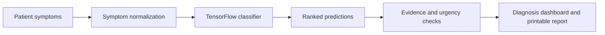

# ML-Powered Medical Diagnosis Assistant

An educational clinical decision-support project that predicts a preliminary
diagnosis from patient-reported symptoms. The system is designed to work on a
single laptop or a local village health-point network, including environments
where internet access is unavailable.

**Configured public address:** [demetra-varietal-cindi.ngrok-free.dev](https://demetra-varietal-cindi.ngrok-free.dev)
(available while the project tunnel is running)

**Final project report:** [Report.pdf](./Report.pdf)

> This project is not a medical device. Its results must not replace diagnosis,
> treatment, or advice from a qualified healthcare professional.

## Project Highlights

- TensorFlow symptom classifier covering **42 disease classes** and **134
  symptom features**.
- Flask dashboard with typed symptom intake, confidence scores, ranked
  predictions, matched evidence, urgency labels, recommended actions, and
  printable reports.
- Offline village-point workflow using local models, datasets, CSS, and
  JavaScript.
- Same-network access from phones or laptops through a local hotspot or LAN.
- Spark-backed aggregate evidence index built from public clinical-style
  datasets.
- Additional COVID-19 differential and fracture-screening support.
- AES-256-GCM encrypted local diagnosis and feedback logs.
- Model comparison and repeatable evaluation scripts.
- Validation with more than 100 clinical scenario test cases.

## How It Works



The application converts entered symptoms into the model vocabulary, predicts
the most likely disease classes, and combines the result with aggregate
evidence, urgency rules, precautions, and supporting symptom matches.

## Run Offline

### 1. Install the requirements

Python 3.10 or newer is recommended.

```powershell
python -m venv .venv
.venv\Scripts\Activate.ps1
pip install -r requirements.txt
```

Dependencies must be installed once. After installation, typed symptom intake
and diagnosis can run without internet access.

### 2. Start the village dashboard

From the project root:

```powershell
.\run_village_dashboard.bat
```

Open the dashboard on the host computer:

```text
http://127.0.0.1:5000
```

The server binds to `0.0.0.0`, so another device connected to the same hotspot
or local network can use:

```text
http://<host-computer-ip>:5000
```

Browser voice input depends on browser support and may require internet access.
Typed symptom entry is the reliable offline workflow.

## Run Manually

```powershell
cd WEB-APP
python app.py
```

Application readiness can be checked at:

```text
http://127.0.0.1:5000/api/health
```

## Publish the Public Dashboard

To expose the local dashboard through the configured ngrok address:

```powershell
.\run_public_ngrok_dashboard.bat
```

The public address works only while the local Flask application and ngrok
tunnel are running. This option requires internet access and is separate from
the offline village workflow.

## Example Symptom Inputs

```text
High fever, cough, chest pain, chills, fatigue, phlegm and breathlessness
Severe headache, nausea, acidity, stiff neck and visual disturbances
Chest pain, breathlessness, sweating and vomiting
```

## Current Evaluation

Evaluation on the project testing dataset produced:

| Metric | Score |
| --- | ---: |
| Accuracy | 0.9762 |
| Precision | 0.9643 |
| Recall | 0.9762 |
| F1-score | 0.9683 |

Run the saved-model evaluation from the project root:

```powershell
python scripts/evaluate_model.py
```

These values represent performance on a small, clean classroom dataset. They
must not be interpreted as real-world clinical accuracy.

## Rebuild Project Artifacts

Retrain the classifier and regenerate model-comparison outputs:

```powershell
python scripts/train_model.py
```

Rebuild the aggregate validation index:

```powershell
python scripts/build_ehr_validation_index.py
```

Generated model and validation artifacts are saved under `BACKEND/models/`.

## Project Structure

```text
Machine-Learning/
|-- BACKEND/
|   |-- models/
|   |   |-- ml_model.h5
|   |   |-- label_encoder.pkl
|   |   |-- symptom_vocabulary.json
|   |   |-- training_summary.json
|   |   |-- evaluation_summary.json
|   |   |-- ehr_validation_index.json
|   |   |-- model_comparison.json
|   |   |-- model_comparison.png
|   |   `-- disease_distribution.png
|   `-- *.ipynb
|-- DATASETS/
|-- WEB-APP/
|   |-- app.py
|   |-- templates/Index.html
|   `-- static/
|       |-- css/style.css
|       `-- js/app.js
|-- scripts/
|   |-- train_model.py
|   |-- evaluate_model.py
|   `-- build_ehr_validation_index.py
|-- docs/
|-- Report.pdf
|-- requirements.txt
|-- run_village_dashboard.bat
`-- run_public_ngrok_dashboard.bat
```

## Privacy and Security

- Diagnosis and feedback events are encrypted locally with AES-256-GCM.
- Local keys, logs, databases, temporary files, and tunnel binaries are
  excluded from Git.
- The aggregate validation index stores disease-level counts and symptom
  support, not patient identifiers.

## Limitations

- The application provides educational decision support, not a confirmed
  diagnosis.
- Testing data is limited and does not represent every population or clinical
  setting.
- Voice recognition availability varies by browser and network connection.
- Public ngrok access is temporary and requires the host computer to remain
  online.

## Team

- Rachith Bharadwaj T N - 24BDS062
- Dhanush Gowda N - 24BDS018
- Shreedhar M Kadkol - 24BDS076
- Kishan Kumar Y - 24BDS031

Guided by **Dr. Utkarsh Mahadeo Khaire**, Department of Data Science and
Artificial Intelligence, IIIT Dharwad.
